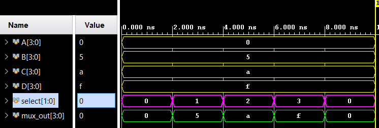

 # 3.2. Ejercicio 2. Multiplexor 4-to-1
 1. Diseñe un multiplexor de cuatro entradas, parametrizado, para un ancho de datos (bus width) de entrada y salida variable.

 2. Realice un banco de prueba (testbench) en el que se muestre de manera simple el funcionamiento del multiplexor. Muestre el resultado de la prueba para anchos de datos de 4, 8 y 16 bit, para los cuatro selecciones de entrada y para al menos un conjunto de datos de
 entrada de 50 datos en cada caso. Su testbench debe autovalidar las salidas esperadas.

 3. Ejecute su prueba y asegúrese de que todos los errores y las advertencias producidas por la simulación hayan sido debidamente atendidas y corregidas.

## Planteamiento de la solución.
 Como se establece en el enuciado tenemos un bus de datos parametrizado para tres casos por lo que se utilizará el comando “parameter” para parametrizar el ancho de bus de los datos de entrada y de salida. 
 Por otro lado, el bus de la selección será solo de 2 bits ya que serán 4 entradas solamente.  
 Usando el comando “case” se usará para determinar cual es la selección que se desea.  

 ## Requrimiento de la solución.
 La idea principal es seleccionar una de 4 entradas y enviarla a las salida según la selección que da la señal de selección en el multiplexor, esta entrada varia en 3 valores de longuitud de 4, 8 y 16 bits.
Por lo cual vamos a tener cuatro entradas (D0, D1, D2 y D3), a una salida Y. Estás entradas seran del width bits y un selector de 2 bits para avarcar la cantidad de selecciones.
Podriamos determinar que esto se determina de la siguiente forma:
Entradas: D0[WIDTH-1:0], D1[WIDTH-1:0], D2[WIDTH-1:0], D3[WIDTH-1:0]
Selector: SEL[1:0]
Bus de datos:[WIDTH-1:0]

# Tabla de verdad para el selector.

| Sel [2 bits] | Salida [bus width] |
|--------------|------------------|
| 00           | D0 [bus width]    |
| 01           | D1 [bus width]    |
| 10           | D2 [bus width]    |
| 11           | D3 [bus width]    |

# Solucion del ejercicio
Acontinuación se preseta el codigo utilizado para determinar el funcionamiento del mux de 4 a 1: 
[Ver código top.sv](4to1mux_using_2to1mux_design.sv)

Como podemos ver este ejercicio es más para determinar la logica del funcionamiento del multiplexor y su cmabios, esto se pude representar a través del siguiente testbech:

Y a continuación el resultado de la simulación:
[Ver código top.sv](4to1_mux_testbench.sv)

# Aplicación el la tarjeta FPGA Nexy 4
Según los componentes perifericos que tiene la tarjeta podemos emplear en ella la funciones para verificar el funcionamiento del multiplexor correctamente. 
Tenemos:

 1. Interruptores para establecer el valor que se debe transmitir en la salida de acuerdo a cada entrada.
 2. Leds para visulizar la salida 
 3. Botones para seleccionar que debe reflejar el multiplexor. 
